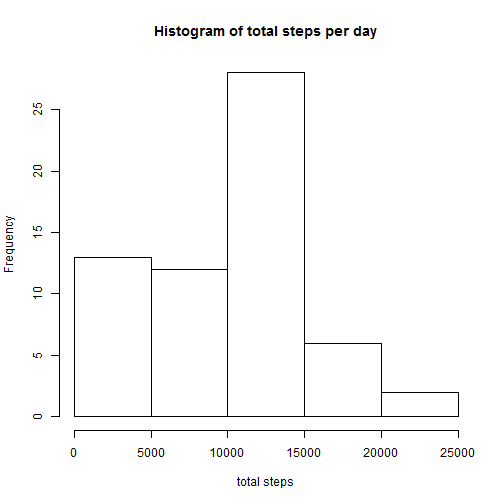
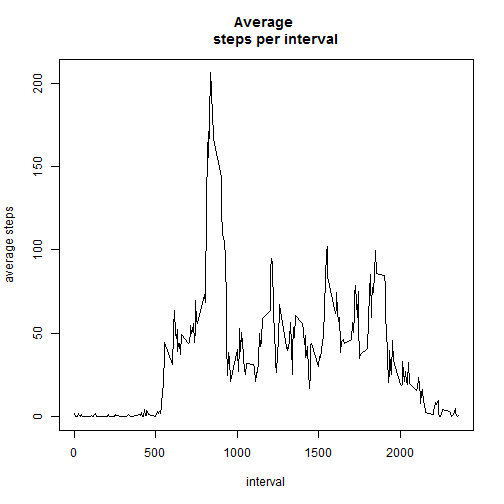
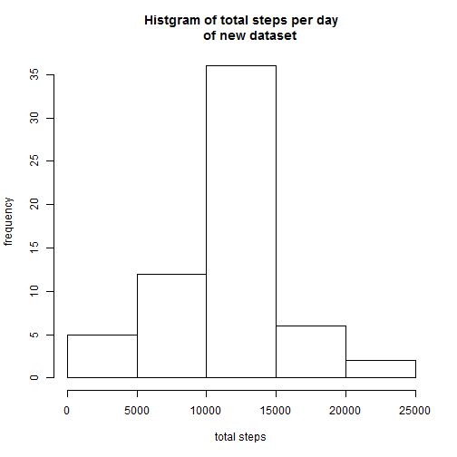
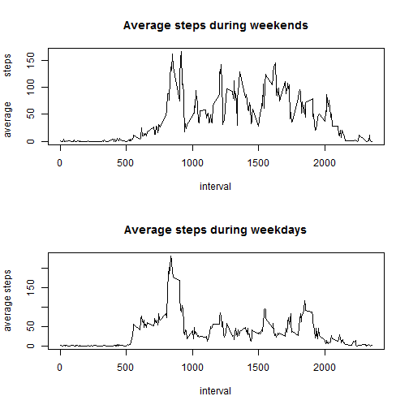

##Loading and preprocessing the data

```r
setwd("d:/coursera/reproducible/week2/repdata_data_activity")
data <- read.csv("activity.csv")
```

## mean total number of steps taken per day
### Here make a histgram of total steps per day 

```r
library(dplyr)
# Here I split the data by date
data_by_date <- group_by(data, date)
table1 <- summarize(data_by_date, sum(steps, na.rm = TRUE))
names(table1) <- c("date", "total steps")
hist(table1$`total steps`, main = "Histogram of total steps per day", xlab = "total steps")
```



### Here calculate the mean and median of total steps per day

```r
mean_total <- mean(table1$`total steps`)
median_total <- median(table1$`total steps`)
```


```r
mean_total
```

```
## [1] 9354.23
```

```r
median_total
```

```
## [1] 10395
```

## The average daily activity pattern
### Plot the average steps for every 5-minute interval

```r
## Here I split the data by interval
data_by_interval <- group_by(data, interval)
table2 <- summarize(data_by_interval, mean(steps, na.rm = TRUE))
names(table2) <- c("interval", "average steps")
plot(table2$"interval", table2$"average steps", type = "l", main = "Average 
     steps per interval", xlab = names(table2)[1], ylab = names(table2)[2])
```



### find the interval which contains on average the maximum steps

```r
index1 <- which.max(table2$`average steps`)
max_interval <- table2$interval[index1]
```

```r
max_interval
```

```
## [1] 835
```

## Imputing missing values
### Calculate the total numbers of rows with missing value

```r
nmissing <- sum(is.na(data$steps))
nmissing
```

```
## [1] 2304
```
### Give the imputing strategy
I will first make a dataframe that consists only of non-missing value of data. And then I will calculate the mean of each interval from the new dataset and fill the missing value with that mean value

```r
data1 <- data[!is.na(data$steps), ]
group_by_interval1 <- group_by(data1, interval)
table3 <- summarize(group_by_interval1, mean(steps))
table3_to_df <- data.frame(table3)
data2 <- data[is.na(data$steps), ]
data2_sort <- arrange(data2, interval)
fill <- rep(table3_to_df[[2]], each = 8)
data2_fill <- mutate(data2_sort, steps = fill)
data_impute <- rbind(data1, data2_fill)
## This is the new dataset filling the missing values
data_impute <- data_impute %>% mutate(date = as.Date(date)) %>% arrange(date, interval)
```

### Report the mean and median of steps per day in the new datasets

```r
impute_total <- data_impute %>% group_by(date) %>% summarize(sum(steps))
head(impute_total)
```

```
## Source: local data frame [6 x 2]
## 
##         date sum(steps)
##       (date)      (dbl)
## 1 2012-10-01   10766.19
## 2 2012-10-02     126.00
## 3 2012-10-03   11352.00
## 4 2012-10-04   12116.00
## 5 2012-10-05   13294.00
## 6 2012-10-06   15420.00
```

```r
names(impute_total) <- c("date", "total steps")
mean_impute <- mean(impute_total[[2]])
median_impute <- median(impute_total[[2]])
```
Here is the histgram of total steps per day for the new dataset

```r
hist(impute_total$"total steps", main = "Histgram of total steps per day
     of new dataset", xlab = "total steps", ylab = "frequency")
```



Here is the mean and median of total steps per day

```r
mean_impute
```

```
## [1] 10766.19
```

```r
median_impute
```

```
## [1] 10766.19
```
The mean and median for the new dataset are larger than the original dataset, since I fill the missing value with the positive numbers.

## Differences in activity patterns between weekdays and weekends

### Create a new feature indicating weekday and weekend for new dataset

```r
library(lubridate)
data_impute <- mutate(data_impute, date = ymd(date))
data_impute <- mutate(data_impute, weekday = wday(date))
data_impute_weekend <- filter(data_impute, weekday %in% c(1, 7))
data_impute_weekdays <- filter(data_impute, weekday %in% 2 : 6)
# get the number of weekends and weekdays
nweekend <- dim(data_impute_weekend)[1]
nweekdays <- dim(data_impute_weekdays)[1]
workday <- rep("weekday", nweekdays)
weekend <- rep("weekend", nweekend)
data_impute_weekend <- mutate(data_impute_weekend, week = weekend)
data_impute_weekdays <- mutate(data_impute_weekdays, week = workday)
data_impute <- rbind(data_impute_weekdays, data_impute_weekend)
## This dataset is the one adding weekday feature
data_impute <- data_impute %>% select(-weekday) %>% arrange(date, interval)
```
Make a plot of the average steps per interval for weekday and weekend respectively

```r
weekend <- data_impute_weekend %>% group_by(interval) %>% 
    summarize(mean(steps))
workdays <- data_impute_weekdays %>% group_by(interval) %>%
    summarize(mean(steps))
names(weekend) <- c("interval", "average steps")
names(workdays) <- c("interval", "average steps")
par(mfrow = c(2,1))
plot(weekend$"interval", weekend$"average steps", type = "l", main = 
    "Average steps during weekends", xlab = "interval", ylab = "average          steps")
plot(workdays$"interval", workdays$"average steps", type = "l",
     main = "Average steps during weekdays", xlab = "interval", ylab =            "average steps")
```




